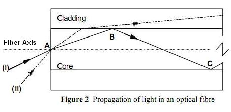
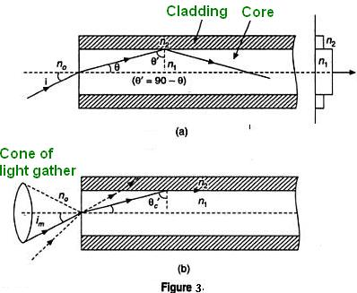

### Theory

<iframe width="560" height="315" src="https://www.youtube.com/embed/b7dLcINlvwE" frameborder="0" allow="autoplay; encrypted-media" allowfullscreen></iframe>

### What is optic fibre?

  

 

Optical fibers are fine transparent glass or plastic fibers which can propagate light. They work under the principle of total internal reflection from diametrically opposite walls. In this way light can be taken anywhere because fibers have enough flexibility. This  property makes them suitable for data communication, design of fine endoscopes, micro sized microscopes etc. An optic fiber  consists of a core that is surrounded by a cladding  which are normally made of silica glass or plastic. The core  transmits an optical signal while the  cladding  guides the light within the core. Since  light is guided through the fiber it is sometimes called an optical wave guide. The basic construction of an optic fiber is shown in figure (1).

  

 

In order to understand the propagation of light through an optical fibre, consider the figure (2). Consider a light ray (i) entering the core at a point A , travelling through the core until it reaches the core cladding boundary at point B. As long as the light ray intersects the core-cladding boundary at a small  angles, the ray will be reflected back in to the core to travel on to point C where the process of reflection is repeated .ie., total internal reflection takes place. Total internal reflection occurs only when the angle of incidence is greater than the critical angle.  If a ray enters an optic fiber at a steep angle(ii), when this ray intersects the core-cladding boundary, the angle of intersection is too large. So, reflection back in to the core does not take place and the light ray is lost in the cladding. This means that to be guided through an optic fibre, a light ray must enter the core with an angle less than a particular angle called the acceptance angle of the fibre. A ray which enters the fiber with an angle greater than the acceptance angle will be lost in the cladding.

Consider an optical fibre having a core  of refractive index $n_{1}$ and cladding of refractive index $n_{2}$. let the incident light makes an angle i with the core axis as shown in figure (3). Then the light gets refracted at an angle θ and fall on the core-cladding interface at an angle where,

  

 

$$\theta '=(90-\theta)............(1)$$

By Snell’s law at the point of entrance of light in to the optical fiber we get,

$$n_{0}\sin i=n_{1}\sin \theta............(2)$$

Where $n_{0}$ is refractive index of medium outside the fiber. For air $n_{0}=1$.

When light travels from core to cladding it moves from denser to rarer medium and so it may be totally reflected back to the core medium if θ' exceeds the critical angle θ'c. The critical angle is that angle of incidence in denser medium (n1) for which angle of refraction become 90°. Using Snell’s laws at core cladding interface,

$$n_{1}\sin \theta'_{c}=n_{2}\sin 90$$

$$\sin \theta'_{c}= \frac{n_{2}}{n_{1}}..............(3)$$

Therefore, for light to be propagated within the core of optical fiber as guided wave, the angle of incidence at core-cladding interface should be greater than <em>θ'</em>c. As i increases,&nbsp; <em>θ</em> increases and so <em>θ' </em>decreases. Therefore, there is maximum value of angle of incidence beyond which, it does not propagate rather it is refracted in to cladding medium ( fig: 3(b)). This maximum value of i say im is called maximum angle of acceptance and&nbsp; n0 sin im is termed as the numerical aperture (NA).

$$NA=n_{0}\sin i_{m}=n_{1}\sin \theta$$

$$=n_{1}\sin (90-\theta_{c})$$

Or $NA=n_{1}\cos \theta'_{c}$

