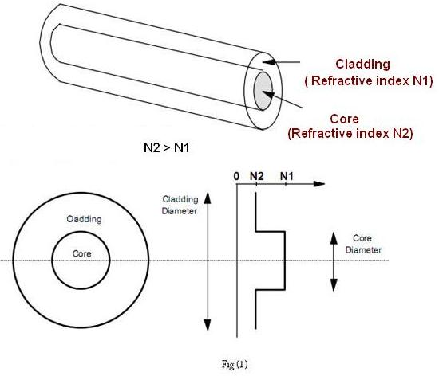

### Theory

<iframe width="560" height="315" src="https://www.youtube.com/embed/b7dLcINlvwE" frameborder="0" allow="autoplay; encrypted-media" allowfullscreen></iframe>

### What is optic fibre?

  
Figure 1: Description of the figure
 

Optical fibers are fine transparent glass or plastic fibers which can propagate light. They work under the principle of total internal reflection from diametrically opposite walls. In this way light can be taken anywhere because fibers have enough flexibility. This  property makes them suitable for data communication, design of fine endoscopes, micro sized microscopes etc. An optic fiber  consists of a core that is surrounded by a cladding  which are normally made of silica glass or plastic. The core  transmits an optical signal while the  cladding  guides the light within the core. Since  light is guided through the fiber it is sometimes called an optical wave guide. The basic construction of an optic fiber is shown in figure (1).

