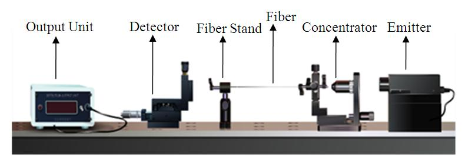
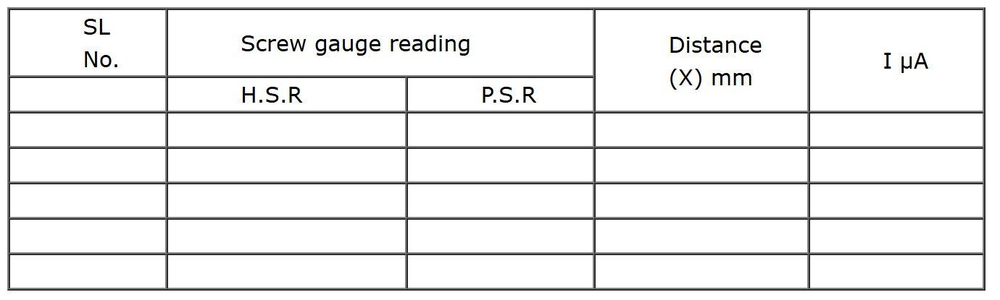

### Procedure

### Procedure for simulator
### Controls 
- **Start button**: Starts the experiment.
- **Switch on**: Turns on the laser.
- **Select Fiber**: Selects the type of fiber used.
- **Select Laser**: Selects a different laser source.
- **Detector distance** (Z): Use the slider to vary the distance between the source and the detector (i.e., toward or away from the fiber).
- **Detector distance**(x): Use the slider to change the detector position (i.e., move left or right with respect to the fiber).
- **Show Graph**: Displays the graph.
- **Reset**: Resets the experimental setup.

### Preliminary Adjustment
Drag and drop each apparatus in to the optical table as shown in the figure below. 

- Then Click “Start” button.
- Switch On (now you can see a spot in the middle of the detector)
- After that select the Fiber and Laser for performing the experiment from the control options.

### To perform the experiment

<ul>
	<li>Set the detector distance Z (say 4mm).&nbsp;We referred the distance as “d” in our calculation. &nbsp;</li>
	<li>Vary the detector distance X by an order of 0.5mm, using the screw gauge (use up and down arrow on the screw gauge to rotate it).</li>
	<li>Measure the detector reading from output unit and tabulate it.</li>
	<li>Plot the graph between X in x-axis and output reading in y-axis. See figure 5.</li>
	<li>Find the radius of the spot r, which is corresponding to Imax/2.71 (See the figure 5).</li>
</ul>

Figure 5

- Then find the numerical aperture of the optic fiber using the equation (4).

### Observation column 

## Calculations
istance between the fiber and the detector, d = …………………………… m  
Radius of the spot, r =……………………….. m  
Numerical Aperture of the optic fiber,  $sin(θ)=\frac{r}{\sqrt{r^{2}+d^{2}}}$ = .................  
Acceptance angle, $θ={sin^{-1}}\left ( \frac{r}{\sqrt{r^2+d^2}} \right )$ = ...............

## Result
Numerical aperture of the optic fiber is = …………………  
Angle of acceptance = ……………….
